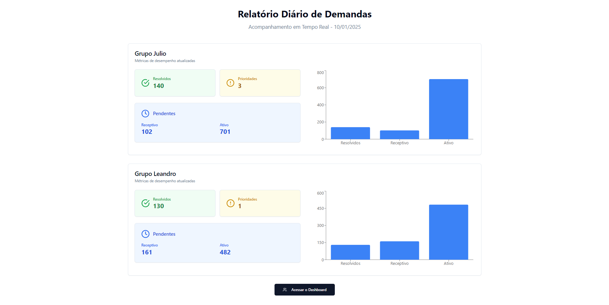

# Demand Count Sentinel 

Sistema de monitoramento de performance com interface CLI interativa.

## Requisitos

- Node.js v18 ou superior
- npm v8 ou superior

## Instalação

1. Limpe a instalação existente e instale as dependências:
```bash
clean-install.bat
```

## Desenvolvimento

Para iniciar o ambiente de desenvolvimento:
```bash
start-dev.bat
```

Isso irá iniciar:
- Servidor de desenvolvimento (Vite) na porta 5173
- Servidor de monitoramento na porta 5175
- Cliente CLI de monitoramento

## Produção

1. Gere o build de produção:
```bash
build-prod.bat
```

2. Inicie o ambiente de produção:
```bash
start-prod.bat
```

Isso irá iniciar:
- Servidor de produção na porta 4173
- Servidor de monitoramento na porta 5175
- Cliente CLI de monitoramento

## Monitoramento

O sistema de monitoramento inclui:

### Servidor de Monitoramento
- Coleta métricas de performance em tempo real
- Armazena logs de erro
- Fornece API REST para acesso aos dados
- Endpoints:
  - GET /metrics - Retorna todas as métricas e erros
  - POST /metrics - Registra nova métrica ou erro

### Cliente CLI
- Interface interativa para visualização de métricas
- Atualização automática a cada 5 segundos
- Comandos disponíveis:
  1. Mostrar métricas de performance
  2. Mostrar logs de erro
  3. Limpar tela
  4. Mostrar análise de performance
  5. Atualizar dados manualmente

### Análise de Performance
- Tempo médio de operação
- Detecção de operações lentas (>1000ms)
- Taxa de erros
- Recomendações automáticas de otimização

## Scripts

- `clean-install.bat` - Limpa a instalação e reinstala dependências
- `start-dev.bat` - Inicia ambiente de desenvolvimento
- `build-prod.bat` - Gera build de produção
- `start-prod.bat` - Inicia ambiente de produção

## Estrutura do Projeto

```
/
├── src/                    # Código fonte da aplicação
├── monitor/               # Sistema de monitoramento
│   ├── server.js         # Servidor de monitoramento
│   ├── cli.js           # Cliente CLI
│   └── package.json     # Dependências do monitor
├── dist/                 # Build de produção
└── scripts/             # Scripts utilitários
```

## Resolução de Problemas

Se encontrar problemas durante a instalação:

1. Feche todos os terminais e o VS Code
2. Execute `clean-install.bat` como administrador
3. Aguarde a conclusão da instalação
4. Inicie o ambiente desejado com `start-dev.bat` ou `start-prod.bat`

Se o problema persistir:
1. Delete manualmente as pastas:
   - node_modules
   - monitor/node_modules
2. Delete os arquivos:
   - package-lock.json
   - monitor/package-lock.json
3. Execute `clean-install.bat` novamente

# Demand Count Sentinel 

> Um dashboard moderno para monitoramento e análise de demandas em tempo real.

[](https://www.typescriptlang.org/)
[](https://reactjs.org/)
[](https://vitejs.dev/)
[](https://tailwindcss.com/)

## Funcionalidades

- **Dashboard Interativo**: Visualização em tempo real de métricas e KPIs
- **Análise Detalhada**: Filtros avançados e análise granular de dados
- **Design Responsivo**: Interface adaptável para desktop e dispositivos móveis
- **Gráficos Dinâmicos**: Visualização de dados com Recharts
- **UI/UX Moderna**: Interface elegante usando Tailwind CSS e Radix UI

## Demo



Acesse nossa [Demo Online](https://manfullwel.github.io/ddemandreport/) para ver o projeto em ação.

## Tecnologias

- **Frontend:**
  - React 18
  - TypeScript
  - Vite
  - TailwindCSS
  - Radix UI
  - Recharts
  - React Router DOM
  - Lucide React (ícones)

- **Desenvolvimento:**
  - ESLint
  - Prettier
  - Husky
  - TypeScript ESLint

## Instalação

1. Clone o repositório:
```bash
git clone https://github.com/manfullwel/ddemandreport.git
cd ddemandreport
```

2. Instale as dependências:
```bash
npm install
```

3. Inicie o servidor de desenvolvimento:
```bash
npm run dev
```

## Scripts Disponíveis

- `npm run dev`: Inicia o servidor de desenvolvimento
- `npm run build`: Gera a build de produção
- `npm run lint`: Executa a verificação de linting
- `npm run format`: Formata o código usando Prettier
- `npm run type-check`: Verifica os tipos TypeScript
- `npm run validate`: Executa todas as verificações (type-check, lint, format)

## Estrutura do Projeto

```
demand-count-sentinel/
├── src/
│   ├── components/     # Componentes React reutilizáveis
│   ├── pages/         # Páginas da aplicação
│   ├── types/         # Definições de tipos TypeScript
│   ├── utils/         # Utilitários e helpers
│   ├── lib/           # Bibliotecas e configurações
│   └── main.tsx       # Ponto de entrada da aplicação
├── public/            # Arquivos estáticos
└── ...                # Arquivos de configuração
```

## Roadmap

- [ ] Implementação de autenticação
- [ ] Integração com backend
- [ ] Exportação de relatórios em PDF
- [ ] Modo dark/light
- [ ] Mais opções de visualização de dados
- [ ] Notificações em tempo real

## Contribuindo

1. Fork o projeto
2. Crie sua Feature Branch (`git checkout -b feature/AmazingFeature`)
3. Commit suas mudanças (`git commit -m 'Add some AmazingFeature'`)
4. Push para a Branch (`git push origin feature/AmazingFeature`)
5. Abra um Pull Request

## Licença

Este projeto está sob a licença MIT. Veja o arquivo [LICENSE](LICENSE) para mais detalhes.

## Autores

- **Manfullwel** - *Desenvolvedor Principal* - [@manfullwel](https://github.com/manfullwel)

## Agradecimentos

- Equipe de design pela inspiração
- Contribuidores e testadores
- Comunidade open source

---
Desenvolvido com por [Manfullwel](https://github.com/manfullwel)