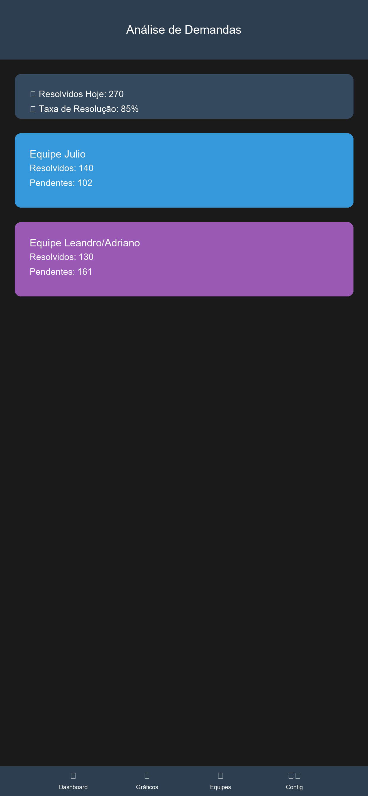
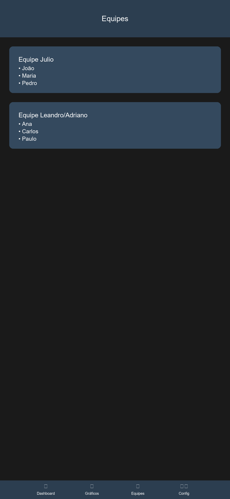

# Sistema de Análise de Demandas

Dashboard profissional para análise e monitoramento de demandas, com foco em métricas de desempenho e insights em tempo real.

[](https://github.com/manfullwel/ddemandreport/actions/workflows/deploy.yml)

## 🔗 Links Importantes

- **[Dashboard](https://manfullwel.github.io/ddemandreport/docs/index.html)**: Acesse o dashboard em funcionamento
- **[Repositório](https://github.com/manfullwel/ddemandreport)**: Código fonte do projeto
- **[Relatório Diário](https://manfullwel.github.io/ddemandreport/docs/index.html#relatorio)**: Relatório atualizado diariamente

## 🌐 Páginas do Projeto

| Página | Link | Descrição |
|--------|------|-----------|
| 📊 **Dashboard** | [Acessar Dashboard](https://manfullwel.github.io/ddemandreport/docs/index.html) | Dashboard principal com todas as métricas |
| 📝 **Relatório Diário** | [Ver Relatório](https://manfullwel.github.io/ddemandreport/docs/index.html#relatorio) | Relatório atualizado diariamente |
| 💻 **Código Fonte** | [GitHub](https://github.com/manfullwel/ddemandreport) | Repositório do projeto |

## 👥 Colaboradores

Um agradecimento especial aos colaboradores que tornaram este projeto possível:

- **Ediane F.** 
- **Victor A.** 
- **Equipe de Desenvolvimento**: Implementação e Testes

## 🔧 Configuração do Google Sheets

Para configurar a integração com o Google Sheets, siga estes passos:

1. **Obtenha as Credenciais**:
   - Acesse o [Google Cloud Console](https://console.cloud.google.com)
   - Crie um novo projeto ou selecione um existente
   - Ative a Google Sheets API
   - Crie uma chave de API em "Credenciais"

2. **Configure o Projeto**:
   - Copie o arquivo `config.example.js` para `config.js`
   - Adicione sua chave API no arquivo `config.js`
   - Adicione o ID da sua planilha (encontrado na URL)
   - Ajuste o range conforme sua estrutura de dados

3. **Estrutura da Planilha**:
   A planilha deve ter as seguintes colunas:
   - Colaborador
   - Data
   - Status (Resolvido/Pendente)
   - Tipo (Receptivo/Ativo)
   - Equipe (Julio/Adriano)

4. **Compartilhamento**:
   - Certifique-se de que a planilha está compartilhada com permissão de leitura

## 📱 Versão Mobile (Em Desenvolvimento)

Estamos desenvolvendo uma versão mobile completa do Sistema de Análise de Demandas, que estará disponível para iOS e Android. O aplicativo oferecerá todas as funcionalidades do dashboard web em uma interface otimizada para dispositivos móveis.

### Preview do App Mobile

```
┌─────────── Análise de Demandas ───────────┐
│                                           │
│    ┌───────── Status Atual ──────────┐    │
│    │ ✅ Resolvidos Hoje: 270        │    │
│    │ 📊 Taxa de Resolução: 85%      │    │
│    └─────────────────────────────────┘    │
│                                           │
│    ┌─────── Equipe Julio ───────────┐    │
│    │ Resolvidos: 140               │    │
│    │ [██████████] 85%              │    │
│    │                               │    │
│    │ Pendentes: 102                │    │
│    │ [████████──] 70%              │    │
│    └─────────────────────────────────┘    │
│                                           │
│    ┌── Equipe Adriano/Leandro ────┐    │
│    │ Resolvidos: 130               │    │
│    │ [█████████─] 80%              │    │
│    │                               │    │
│    │ Pendentes: 161                │    │
│    │ [███████───] 60%              │    │
│    └─────────────────────────────────┘    │
│                                           │
│    ┌────── Menu Rápido ─────────┐    │
│    │ [📊] Dashboard  [📈] Gráficos │    │
│    │ [👥] Equipes   [⚙️] Config   │    │
│    └─────────────────────────────────┘    │
│                                           │
└───────────────────────────────────────────┘
```

### Recursos do App Mobile

- **Interface Adaptativa**: Design responsivo que se ajusta a diferentes tamanhos de tela
- **Gestos Intuitivos**: Navegação por gestos para uma experiência fluida
- **Modo Offline**: Acesso aos dados mesmo sem conexão
- **Notificações Push**: Alertas em tempo real sobre atualizações importantes
- **Biometria**: Autenticação segura por impressão digital ou Face ID
- **Widgets**: Visualização rápida das métricas principais na tela inicial
- **Dark Mode**: Suporte a tema escuro para melhor visualização

### Tecnologias Mobile

- **Frontend Mobile**:
  - React Native
  - Expo
  - Native Base UI
  - React Navigation
  
- **Recursos Nativos**:
  - Notificações Push
  - Armazenamento Local
  - Biometria
  - Geolocalização
  - Câmera (para scan de QR Code)

### Screenshots do App (Preview)

<div align="center">



</div>

### Status do Desenvolvimento

- [x] Protótipo de Interface
- [x] Arquitetura do App
- [x] Implementação do Dashboard
- [ ] Integração com API
- [ ] Testes Beta
- [ ] Lançamento na App Store
- [ ] Lançamento na Play Store

## 🌟 Inspiração do Projeto

Este projeto foi inspirado na necessidade de ter uma visão clara e objetiva das demandas diárias da equipe. As principais inspirações foram:

- **Dashboards Modernos**: Design inspirado em ferramentas como Tableau e Power BI
- **Metodologias Ágeis**: Kanban e Scrum para visualização de fluxo de trabalho
- **Análise de Dados**: Técnicas de data visualization e analytics

## 🚀 Funcionalidades

### 1. Dashboard Interativo

#### Métricas em Tempo Real
- Métricas atualizadas em tempo real
- Gráficos dinâmicos e interativos
- Comparativo entre equipes
- Visualização de pendências

### 2. Análise de Métricas

#### Análise de Desempenho
- KPIs individuais e por equipe
- Distribuição de pendências
- Comparativos entre grupos
- Totalizadores gerais

### 3. Insights Automáticos

#### Relatórios Diários
- Resumo diário por equipe
- Distribuição de demandas
- Métricas de produtividade
- Indicadores de desempenho

## 📊 Visualizações

O dashboard inclui as seguintes visualizações:

1. **Comparativo de Desempenho**
   - Resolvidos
   - Pendentes Receptivo
   - Pendentes Ativo
   - Análises do Dia

2. **Distribuição de Pendências**
   - Pendentes Receptivo por equipe
   - Pendentes Ativo por equipe

3. **Totalizadores**
   - Quitados
   - Quitados Cliente
   - Quitado Aprovado
   - Aprovados
   - Aprovados Duplos

## 🛠️ Tecnologias Utilizadas

- **Frontend**: HTML5, CSS3, Bootstrap 5
- **Visualização**: Python (Matplotlib, Seaborn)
- **Análise de Dados**: Pandas, NumPy
- **Estilo**: CSS Grid, Flexbox

## 📈 Exemplo de Relatório

```
RELATÓRIO GERAL DE DEMANDAS (10/01/2025)

🔵 Equipe Julio
- Resolvidos: 140
- Pendentes Receptivo: 102
- Pendentes Ativo: 701
- Análises do Dia: 3

🔵 Equipe Adriano/Leandro
- Resolvidos: 130
- Pendentes Receptivo: 161
- Pendentes Ativo: 482
- Análises do Dia: 20

🎯 Totalizadores
- Quitados: 26
- Quitados Cliente: 1
- Quitado Aprovado: 0
- Aprovados: 91
- Aprovados Duplos: 6
```

## 🔄 Atualizações Recentes

- Novo design mais profissional e moderno
- Gráficos otimizados para melhor visualização
- Métricas mais relevantes em destaque
- Layout responsivo e adaptativo
- Cores e estilos padronizados

## 📱 Responsividade

O dashboard é totalmente responsivo e se adapta a diferentes tamanhos de tela:
- Desktop
- Tablet
- Mobile

## 🔜 Próximas Atualizações

1. Filtros avançados por período
2. Exportação de relatórios em PDF
3. Modo escuro
4. Alertas personalizados
5. Dashboard em tempo real

## 📄 Licença

Este projeto está sob a licença MIT. Veja o arquivo [LICENSE](LICENSE) para mais detalhes.