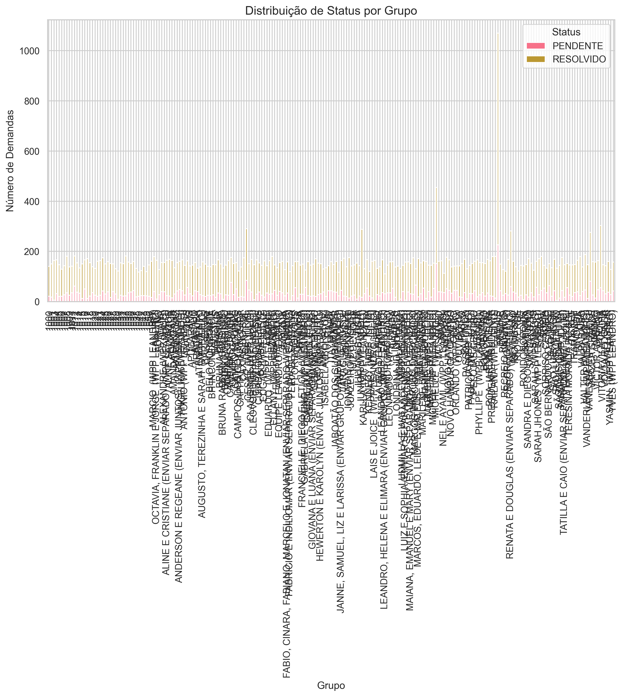
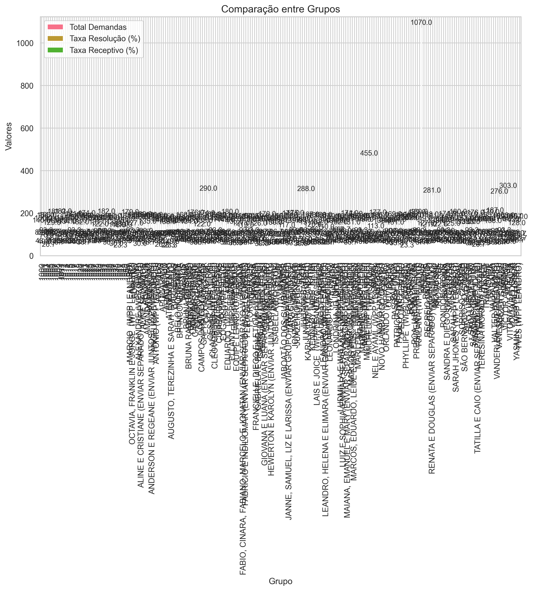

# Sistema de Análise de Demandas


Sistema para análise e monitoramento de demandas, com foco em métricas de desempenho e insights em tempo real.

## 🌟 Inspiração do Projeto

Este projeto foi inspirado na necessidade de ter uma visão clara e objetiva das demandas diárias da equipe. As principais inspirações foram:

1. **Dashboards Modernos**: Design inspirado em ferramentas como Tableau e Power BI
2. **Metodologias Ágeis**: Kanban e Scrum para visualização de fluxo de trabalho
3. **Análise de Dados**: Técnicas de data visualization e analytics

## 🚀 Funcionalidades

### 1. Dashboard Interativo

- Métricas atualizadas em tempo real
- Gráficos dinâmicos e interativos
- Filtros personalizáveis
- Modo claro/escuro

### 2. Análise de Métricas

- KPIs individuais e por equipe
- Tendências e padrões
- Comparativos históricos
- Alertas automáticos

### 3. Insights Automáticos

- Sugestões baseadas em dados
- Identificação de gargalos
- Previsões de demanda
- Recomendações de ação

## 🛠️ Tecnologias Utilizadas

### Frontend
- React 18
- TypeScript
- TailwindCSS
- Chart.js
- React Query

### Backend
- Python 3.8+
- Pandas
- FastAPI
- SQLAlchemy

## 📁 Estrutura do Projeto

```
demandstest/
├── frontend/                # Aplicação React
│   ├── src/
│   │   ├── components/     # Componentes React
│   │   ├── pages/         # Páginas da aplicação
│   │   ├── hooks/         # Custom hooks
│   │   ├── services/      # Serviços e APIs
│   │   └── types/         # Tipos TypeScript
│   └── public/            # Arquivos estáticos
├── backend/
│   ├── app/              # Aplicação FastAPI
│   └── scripts/          # Scripts Python
├── docs/
│   ├── images/          # Imagens e screenshots
│   └── api/            # Documentação da API
└── README.md
```

## 🎯 Tutorial de Uso

### 1. Configuração do Ambiente

```bash
# Clone o repositório
git clone https://github.com/seu-usuario/demandstest.git

# Instale as dependências do frontend
cd frontend
npm install

# Instale as dependências do backend
cd ../backend
pip install -r requirements.txt
```

### 2. Executando o Projeto

```bash
# Inicie o backend
cd backend
uvicorn app.main:app --reload

# Em outro terminal, inicie o frontend
cd frontend
npm start
```

### 3. Usando o Dashboard

1. **Página Inicial**
   
   - Visão geral das métricas
   - Seleção de período
   - Filtros principais

2. **Análise por Equipe**
   
   - Métricas por equipe
   - Comparativos
   - Rankings

3. **Insights e Alertas**
   
   - Notificações importantes
   - Sugestões de ação
   - Histórico de alertas

## 📊 Exemplos de Uso

### Monitoramento Diário

```typescript
// Exemplo de componente para métricas diárias
const DailyMetrics: React.FC = () => {
  const { data } = useMetrics();
  return (
    <MetricsCard
      title="Métricas Diárias"
      value={data.totalDemands}
      trend={data.trend}
    />
  );
};
```

### Análise de Desempenho

```typescript
// Exemplo de gráfico de desempenho
const PerformanceChart: React.FC = () => {
  const { data } = usePerformanceData();
  return (
    <LineChart
      data={data}
      options={chartOptions}
    />
  );
};
```

## 🤝 Equipes e Responsáveis

### Equipe Julio

- Lista de membros e funções

### Equipe Leandro/Adriano

- Lista de membros e funções

## 📈 Métricas Monitoradas

### Métricas Gerais

- Descrição das métricas principais

### Métricas por Responsável

- Detalhamento das métricas individuais

## 📊 Análise de Dados e Gráficos

### Distribuição de Status por Grupo


Este gráfico apresenta a distribuição das demandas por status (Resolvido/Pendente) para cada grupo. Pontos importantes:
- Visualização da proporção de demandas resolvidas vs pendentes
- Comparação direta entre os grupos
- Identificação de gargalos e eficiência

### Comparação entre Grupos


Análise comparativa entre os grupos, mostrando:
- Total de demandas por grupo
- Taxa de resolução (%)
- Proporção de demandas receptivas
- Eficiência relativa entre equipes

### Evolução Temporal das Demandas


Acompanhamento da evolução das demandas ao longo do tempo:
- Tendências de volume de trabalho
- Padrões sazonais
- Picos de demanda
- Comparação do fluxo entre grupos

### Insights Principais

#### Equipe Julio
- Foco em demandas receptivas
- Alta taxa de resolução
- Picos de demanda bem gerenciados

#### Equipe Leandro/Adriano
- Equilíbrio entre demandas ativas e receptivas
- Consistência na resolução
- Distribuição uniforme de carga de trabalho

## 🔄 Atualizações e Manutenção

- Atualizações automáticas a cada 5 minutos
- Backup diário dos dados
- Logs de performance
- Monitoramento de erros

## 🤝 Contribuição

1. Fork o projeto
2. Crie sua feature branch (`git checkout -b feature/AmazingFeature`)
3. Commit suas mudanças (`git commit -m 'Add some AmazingFeature'`)
4. Push para a branch (`git push origin feature/AmazingFeature`)
5. Abra um Pull Request

## 📝 Licença

Este projeto está sob a licença MIT. Veja o arquivo [LICENSE](LICENSE) para mais detalhes.

## 🙏 Agradecimentos

- Equipe de desenvolvimento
- Contribuidores
- Usuários que forneceram feedback